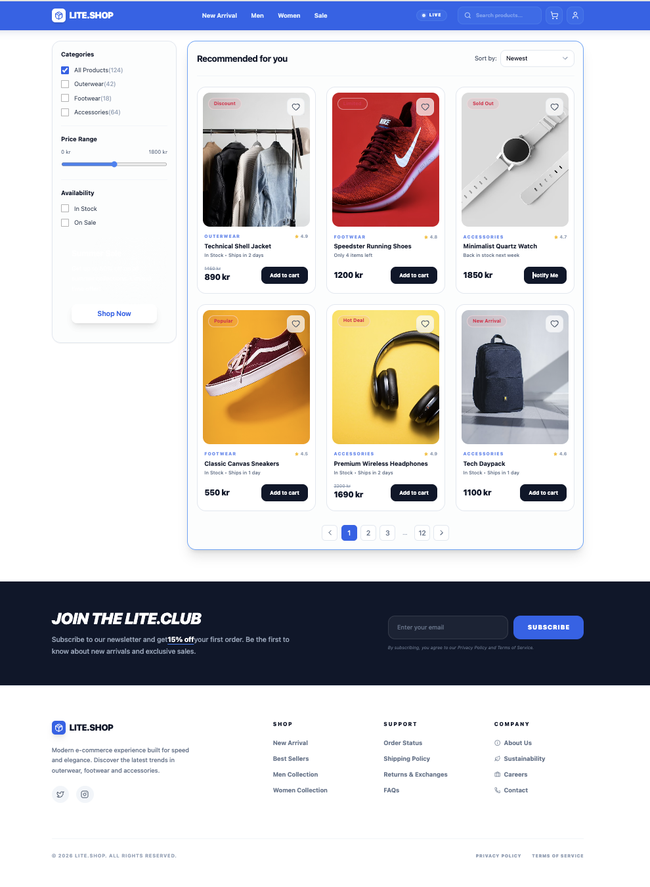

# ReactJS Workshop1 (Components & Props) - Interactive Store

## Goal

A modern e-commerce UI by converting a static HTML layout into a fully component-based React application using:
* React
* Vite
* TypeScript
* Tailwind CSS
* lucide-react

The focus is on component-based architecture, reusability, and clean frontend practices.

---
## Components and Purposes
* Header 
  * Contains the logo, navigation bar, and top-level actions.
* Sidebar
  * Acts as a container for filters (categories, etc.).
* ProductSection
  * Main container that combines product header, grid, and pagination.
* ProductList
  * Maps through product data and renders multiple ProductCard components.
* ProductCard
  * Displays individual product details such as image, category, price, and etc.
* Pagination
  * Handles navigation between pages (UI structure).
* Footer
  * Displays footer layout and organizes link sections.
* FooterLinksColumn
  * Reusable component for rendering grouped links with optional icons.

---
## Props Passed Between Components
* Navigation bar 
  * items → array of navigation links 
* Sidebar Categories
  * items → category list with name and count
* ProductList
  * products → array of product objects
* ProductCard
  * image, name, category, rating, price, etc.
* FooterLinksColumn
  * title → section title 
  * links → array of links (with optional icons)

---
## Why Props Were Used

Props are used to:
* Pass dynamic data into reusable components
* Avoid hardcoding UI content
* Improve flexibility and scalability
* Allow components to be reused with different data

This makes the application more maintainable and closer to real-world React architecture.

---
## How Components Work Together
1. App acts as the root component.
2. Header, Sidebar, ProductSection, and Footer are rendered inside it.
3. Sidebar manages filter UI (categories).
4. ProductSection organizes:
	* ProductList (list of products)
	* Pagination
5. ProductList maps product data and renders multiple ProductCard components.
6. Footer uses FooterLinksColumn to render structured link sections.
7. Props flow from parent → child to dynamically render UI.

---
## Screenshot

